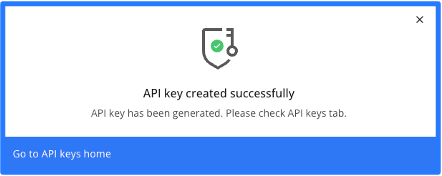
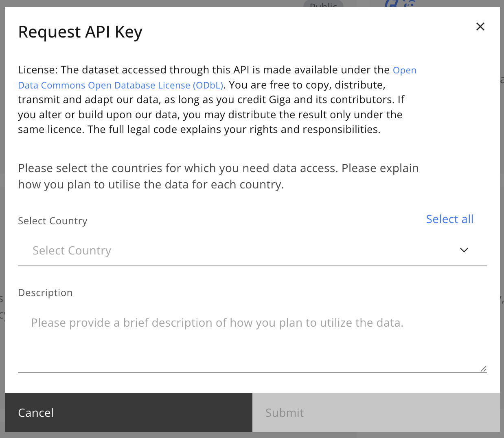
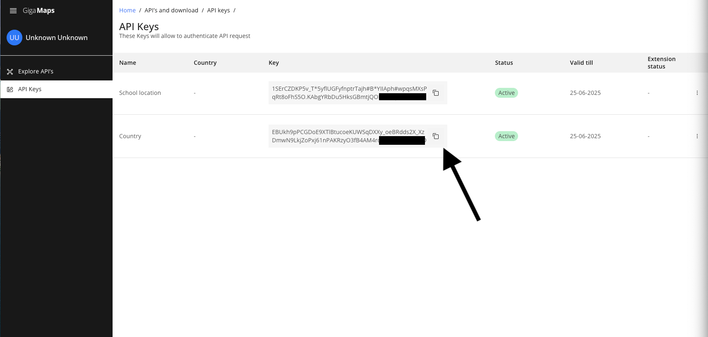
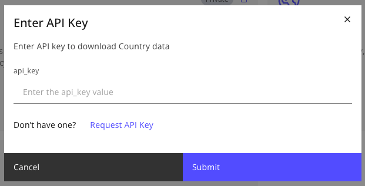

# Getting started

## Requesting an API Key

* Visit [Giga Maps API Dashboard](https://maps.giga.global/docs/explore-api)

* LogIn and select the API your interested in to request an API.

* Click on the documentation button and click the request text to successfully request for a API key.

 

**Note:** This process must be done for every API as every API uses a unique API key.  
 

**For public APIs:** your API key will be approved automatically after requesting.  

 

 

**For private APIs:** you will be prompted to submit more information. A member of the Giga team will review your request and grant access accordingly.

You will receive an email from gigamaps@unicef.org once your API key. Is approved. This might take 1-2 days.

 

## Viewing your Keys

Go to the API keys page, navigating via the left-side panel. Copy the API key and return to the **Explore APIs** page.

**Note:** You can only use an API key for the API that it has been approved for.

 

## Accessing the Data

Paste the API key into the text field and Click submit.

 

